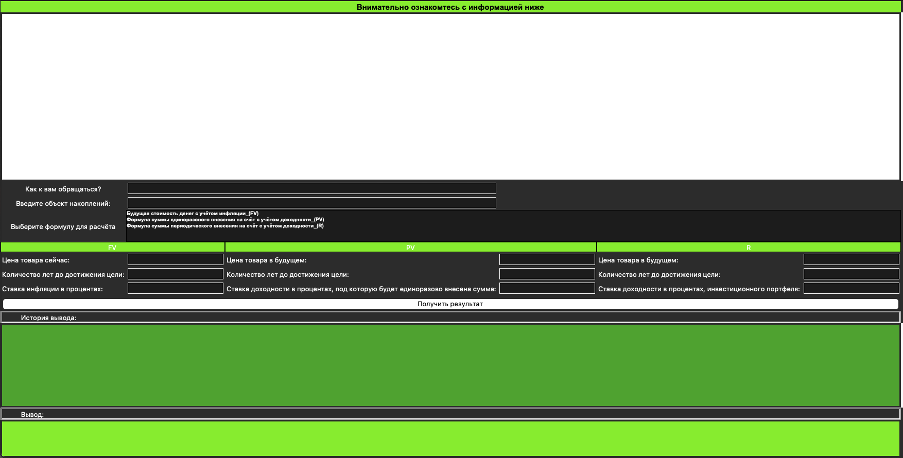

# Финансовый помощник

Десктопное приложение на **Python** с графическим интерфейсом (**Tkinter**), которое помогает сформулировать финансовые цели и посчитать суммы для накоплений с учётом инфляции и доходности.



## Возможности

- **Обучающий блок** — встроенный текст о страничном финансовом плане, методе «5 зачем» и постановке целей по **SMART**.
- **Персонализация** — поля «Как к вам обращаться?» и «Объект накоплений» (на что копите).
- **Три режима расчёта** (выбор в списке):
  1. **FV** — будущая стоимость с учётом инфляции: по текущей цене, сроку в годах и ставке инфляции оценивается, сколько будет стоить цель в будущем.
  2. **PV** — разовый взнос: по желаемой сумме в будущем, сроку и ставке доходности считается, какую сумму нужно внести один раз сегодня (в интерфейсе указано как вложение в ценные бумаги).
  3. **R** — регулярные взносы: по целевой сумме в будущем, сроку и доходности портфеля считается годовой платёж и приблизительный **ежемесячный** взнос.
- **История и вывод** — последний результат показывается в блоке «Вывод»; при новом расчёте предыдущий текст добавляется в «Историю вывода» (с прокруткой).

Цепочка расчётов в интерфейсе: результат **FV** может подставляться в поля для **PV**, результат **PV** — в поля для **R** (удобно идти от «цена сейчас» к «сколько отложить»).

## Требования

- **Python 3** со встроенным модулем `tkinter` (обычно есть в официальных сборках для Windows и macOS; на некоторых дистрибутивах Linux пакет называется `python3-tk`).
- Дополнительные библиотеки не нужны (используются только стандартные `tkinter` и `math`).

## Запуск

Из каталога проекта:

```bash
python3 Application.py
```

При наличии файла `dddd.ico` в той же папке он используется как иконка окна; если файла нет, приложение запускается без иконки.

## Структура проекта

| Файл / папка   | Назначение                          |
|----------------|-------------------------------------|
| `Application.py` | Основной код приложения и логика расчётов |
| `screenshot.png` | Иллюстрация интерфейса для README     |
| `dddd.ico`     | Иконка окна (опционально)           |
| `build/`       | Собранные артефакты (например, установочный пакет), если используются |

## Ограничения

- В полях ввода ожидаются **целые числа**; при пустых полях или незаполненных обязательных данных выводится `Error`.
- Тексты и подсказки в интерфейсе носят **образовательный** характер; для реальных инвестиционных решений стоит консультироваться со специалистами и учитывать налоги, комиссии и изменение условий.
